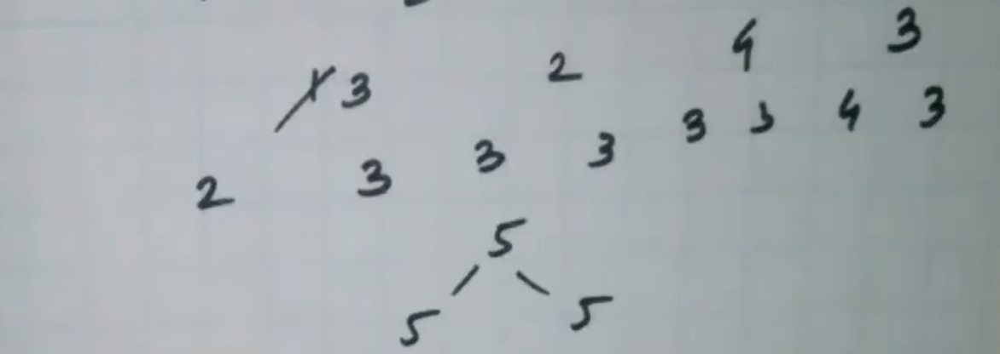
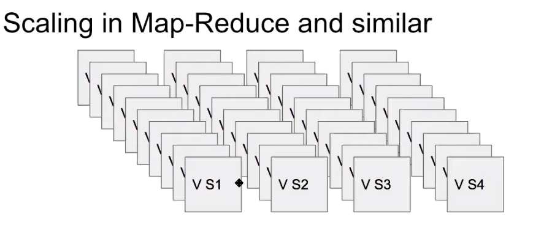

# Requirements and Goals of the System
## Functional requirement
- Design a search system that returns a set of all document ids that contains the all terms in a search string
- limited by dictionary, similar to applying double quotes in Google while searching 
- Entire index is already stored in memory
## Not in scope
- Word sequence does not matter (interview kick start rocks)
- Relevance does not matter (Not doing any ranking )
- The actual document does not matter; some processing is already done so that we can deal with words and document ids; 
- document processing to build index is not in scope
- Pagination not required, not really interested client server network bandwidth 
## Design constraints
- static dataset i.e not handling stream of incoming new data
- Documents in the order of trillion
- Has to be fast: 100ms
- Search per seconds: 40k

# System API
```
GET /search?q=string
Response: 
[
    "d1", "d2","d3"
]
```
## Schema of inverted hashmap in memory index 
```
{
    <string>: string[]
}
```
Following is one example
```
{
    w1: [d1, d2,....... dn]
    w2: [d1, d2,....... dn]
    w3: [d1, d2,....... dn]
    .
    .
    wk: [d1, d2,....... dn]
}
```
# Simple Search Algorithm
- For all terms; get their sorted document ids list
- Use priority queue i.e. heap binary tree of size terms
- If tree is unival then document is common across all word 
- Once unival is found then remove all these documentIds from priority queue
## Example
Interview : [1,3,5,7,9]

Kickstart: [2,4,5,8]

Rock: [3, 5, 7]


## Time complexity
- If number of terms is k and size of list is n: O(nk(logk + k))
    - O(n) time, O(k) auxiliary space
    - k is negligible as n is in trillions
    - Worst case complexity is O(trillion) which is not acceptable. To solve it we need to scale.

## Storage estimate(memory and persistence)?
- Storage
    - A = Number of K-Vs
    - B = size of a (K-V) pair
    - Total size = A * B
- Often the theoretical max of K-Vs can be too large, better way to estimate is
    - C = How many new K-Vs / seconds
    - D = Plan for 2-3 years
    - Total projection = C * D * 365 * 24 * 60 * 60
    - Prevent over provisioning 
- For this problem
    - Read only data set, no question of rate
    - A = number of words in a dictionary i.e 500,000
    - B = 100 kb (Based on sampling)
    - Total = A * B = 500,000 * 100 kb = 500 Tb
## Need for API parallelism?
- API response time or latency has to come down from worst case O(trillion) to something that maps to 100ms
- O(10,000) ~ 100 ms (Assumption with commodity servers i.e. run for loop 10,000 times and measure time taken)
- Irrespective to my business, I want the system to execute search with a worst case of O(10,000)
- In our case; O(trillion) will be O(1000,000,000,000) ~ 1000,000,00 * 100 ms ~ 2.77 hours

## Need for compute throughput
How to compute throughput by a server?
- How much throughput a single server will give?
- Given any server, all I need to know is, how much time API will take.
- API will flow through App server, cache server and storage server
- All I need to know is latency i.e. how much time API will take on each servers
- Assume server will take X ms to process one API 
- let's assume X = 100ms
- A single thread can do 1000/X ~ 1000/100 ~ 10 searches per seconds
  Note: Based on commodity server, a single thread can do 1000/X ops per second
- In a commodity server (with 10-12 core cpu), around 100 to 200 threads can work in parallel (need to do experiment to figure out)
- Total = 100 * 10 searches per seconds ~ 1k searches per seconds
- 1k searches per seconds is utilizing full capacity
- typically servers runs at 30-60% CPU capacity
- i.e. 300 searches per seconds or 600 searches per seconds per server
- i.e. 30,000/X ops per seconds
- i.e. 30,000/100 ~ 300 ops second


How much we need?
- Goal is 40k search per seconds
- Total servers Y = 40k / (300 or 600) ~ 130 or 60 servers

How much is our throughput with single server?
- Any server can give me 30,000/X ops per second
- For O(trillion) algorithm; one thread will take 2.77 hours
- Throughput = 30,000/2.77*60*60*1000 ~ 0
- I.e. we first need to bring down API latency down

## Optimized search algorithm
### How to shard data?
Two ways to divide data
- Horizontal shardig ie. divide data horizontally and place each shards on separate server (For example  Mongodb, Cassandra etc)
- Vertical sharding i.e. divide data vertically and place each shard on separate server. 
- Hybrid

### Horizontal sharding for word index
- [aa to ap] = shard0 goes on server A, C & E
- [aq to az] = shard1 goes on server B, D 
- Load balancer has to do merge
- For example; if we search for "hello world"
- "hello" will return 1 million documents as per shard
- "world" will return 1 million documents as per shard
- Now load balancer needs to merge these two result
- This defeat our goal as work item is still took high i.e. 1 million
- We are looking to reduce work item as O(10,000) as worst case
- Therefore horizontal sharding doesn't work so now divide data vertically
### Divide data into vertically
- Keep all keys but some values
On shard0:
```
w0 - [1 to 10,000] 
w1 - [1 to 10,000]
.
.
wk - [1 to 10,000]
```
On shard1:
```
w0 - [10,000 to 20,000] 
w1 - [10,000 to 20,000] 
.
.
wk - [10,000 to 20,000] 
```

For example
```
"hello": [1, 5, 7, 15000] 
"world": [1,5, 17000]
```

On shard0:
```
"hello": [1, 5, 7] 
"world": [1, 5]
```

On shard1:
```
"hello": [15000] 
"world": [17000]
```

ie. needs to do scatter & gather. This is bcz every shards has data we are looking for. 
- On each machine; it is only working on small subset as 10k
- This is a map reduce paradigm
- It is nothing but API parallelism
- We chopped data vertically bcz size of documents was bottleneck
- Analytics system has to do API parallelism i.e. scatter gather

### What is problem with scatter gather?
- Let's say if we get 10 search per second.
- How many searches each shards receives?
    - 10 bcz request is send to every shard
- With 100ms each shard is running in 100ms to search in 10k documents
- A single shard can do 300 searches per seconds
- If all shards starts receiving 300 searches per seconds; how much will be our throughput?
    - 300
- So we are bottleneck by single shard system
- I want 40k searches per seconds
- So I have to replicate whole architecture to parallel processing
- Google is throughput hungry problem

Scaling in Map Reduce and similar


- How much replicas we need to handle 40k searches per seconds?
- Replicas of each shard = 40k/300 ~ 133

###  Conclusion
- Search API didn't change, instead of running on bigger data set, now it runs on small data set
- Data is sharded vertically, since document index are in integer range, so each shard has set of  possible i to i+10000 index i.e. it will not overlap
- More replicas are added to support throughput
