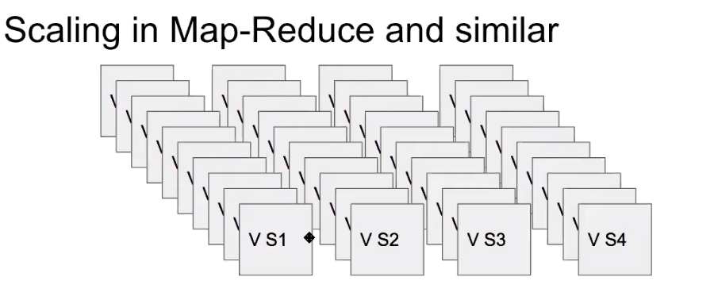

# Step 1: 
## Collection functional requirement
- Design a search system that returns a set of all document ids that contains the all terms in a search string (limited by dictionary)
- Sequence does not matter
- Relevance does not matter
- The actual document does not matter; some processing is done so that we can deal with words and document ids; processing is not in scope
- Paging not required, not really interested client server network bandwidth 
- Static database

## Collect design constraints
- Documents in the order of trillion
- Has to be fast; 100s of ms
- 40k search per seconds

# Step 2:
## Micro services
- Search micro service
Clearly a depth oriented problem

# Step 3:


# Step 4
## Deep dive on each micro services at a time
- App tier, in-memory tier, no storage tier needed
- Data model
    - k-v: k- words, v- sorted list of document ids(inverted index)
    w1: [d1, d2,....... dn]
    w2: [d1, d2,....... dn]
    w3: [d1, d2,....... dn]
    .
    .
    wk: [d1, d2,....... dn]
- How to store in memory?
    - Hash map

- API: search(List<string> searchString)
    - For all items; get their sorted document ids list
    - Piggy back on merge of k-sorted list
    - Check weather the binary tree corresponding to priority queue is unival
    - heapify
- If number of terms is k and size of list is n: O(nk(logk + k))
    - O(n) time, O(k) auxiliary space
    - k is negligible as n is in trillions
    - worst case time complexity: O(trillion)
### Algorithm
```
const commonSortedElements = (kSortedList) => {
    const commonElements = [];
    // Initialize heap
    const minHeap = new MinHeap();
    for(const list of kSortedList) {
        minHeap.add(list);
    }
    const k = kSortedList.length;
    while(minHeap.arr.length === k) {
        // check if heap is unival tree
        if(isUnivalTree(minHeap)){
            const top = minHeap.arr[0];
            commonElements.push(top.val);
        }
        // remove lowest from heap
        const lowest = minHeap.remove();
        if(lowest.next) {
            minHeap.add(lowest.next);
        }

    }
}
```
Order of complexity:
    = O(nklogk + nk * k)
    = O(nk(logk + k))
    = O(n) as k is small compare to n
Order of space:
    = O(k)
    = constant time as compare to value we have for n
Worst case complexity is O(trillion) which is not acceptable. To solve it we need to scale.


## Each micro services consists of one of more tiers
We need to scale system to fit data into single box. 

### Need to scale for storage (memory and persistence)?
- Storage
A = Number of K-Vs
B = size of a (K-V) pair
Total size = A * B
- Often the theoretical max of K-Vs can be too large, better way to estimate is
    - C = How many new K-Vs / seconds
    - D = Plan for 2-3 years
    - Total projection = C * D * 365 * 24 * 60 * 60
    - Prevent over provisioning 
- For this problem
    - Read only data set, no question of rate
    - A = number of words in a dictionary i.e 500,000
    - B = 100,000 (Based on sampling)
    - Total = A * B
            = 500,000 * 100,1000
            = 500 Tb
### Need for API parallelism?
- API response time or latency has to come down from worst case O(trillion) to something that maps to 100ms
- O(10,000) ~ 100 ms (Assumption with commodity servers)
- Irrespective to my business, I want the system to execute search with a worst case of O(10,000)
- In our case; O(trillion) will be O(1000,000,000,000) ~ 1000,000,00 * 100 ms ~ 2.77 hours


### Need for compute throughput
How to compute throughput by a server?
- How much throughput a single server will give?
- Given any server, all I need to know is, how much time API will take.
- API will flow through App server, cache server and storage server
- All I need to know is latency i.e. how much time API will take on each servers
- Assume server will take X ms to process one API 
- let's assume X = 100ms
- A single thread can do 1000/X ~ 1000/100 ~ 10 searches per seconds
- In a commodity server (with 10-12 core cpu), around 100 to 200 threads can work in parallel (need to do experiment to figure out)
- Total = 100 * 10 searches per seconds ~ 1k searches per seconds
- 1k searches per seconds is utilizing full capacity
- typically servers runs at 30-40% CPU capacity
- i.e. 300 searches per seconds or 600 searches per seconds per server
- i.e. 30,000/X ops per seconds
- i.e. 30,000/100 ~ 300 ops second


How much we need?
- Goal is 40k search per seconds
- Total servers Y = 40k / (300 or 600) ~ 130 or 60 servers

How much is our throughput with single server?
- Any server can give me 30,000/X ops per second
- For O(trillion) algorithm; one thread will take 2.77 hours
- Throughput = 30,000/2.77*60*60*1000 ~ 0
- I.e. we first need to bring down API latency down

## Build scalable system
Two ways to divide data
- Horizontal shardig ie. divide data horizontally and place each shards on separate server
- Vertical sharding i.e. 
- Hybrid
Zookeeper is the cluster manager to hold data distribution. Horizontal is common ways to shard data.
### Horizontal sharding for word index
[aa to ap] = shard0 goes on server A, C & E
[aq to az] = shard1 goes on server B, D 
- Load balancer has to do merge
- For example; if we search for "hello world"
- "hello" will return 1 million documents as per shard
- "world" will return 1 million documents as per shard
- Now load balancer needs to merge these two result
- This defeat our goal as work item is still took high i.e. 1 million
- We are looking to reduce work item as O(10,000) as worst case
- Therefore horizontal sharding doesn't work so now divide data vertically
### Divide data into vertically
- Keep all keys but some values
On shard0:
w0 - [1 to 10,000] 
w1 - [1 to 10,000]
.
.
wk - [1 to 10,000]

On shard1:
w0 - [10,000 to 20,000] 
w1 - [10,000 to 20,000] 
.
.
wk - [10,000 to 20,000] 

For example
"hello": [1, 5, 7, 15,000] shard0 and shard1
"world": [1,5, 17,000]

ie. needs to do scatter & gather. This is bcz every shards has data we are looking for. 
- On each machine; it is only working on small subset as 10k
- This is a map redue paradigm
- It is nothing but API parallism
- We chopped data vertically bcz size of documents was bottleneck
- Analytics system has to do API parallism i.e. scatter gather

What is problem with scatter gather?
- Let's say if we get 10 search per second.
- How many searches each shards receives?
    - 10 bcz request is send to every shard
- With 100ms each shard is running in 100ms to search in 10k documents
- A single shard can do 300 searches per seconds
- If all shards starts receiving 300 searches per seconds; how much will be our throughput?
    - 300
- So we are bottleneck by single shard sytem
- I want 40k searches per seconds
- So I have to replicate whole architecture to parallel processing
- Google is throughput hungry problem

Scaling in Map Reduce and similar


- How much replicas we need to handle 40k searches per seconds?
- Replicas of each shard = 40k/300 ~ 133

